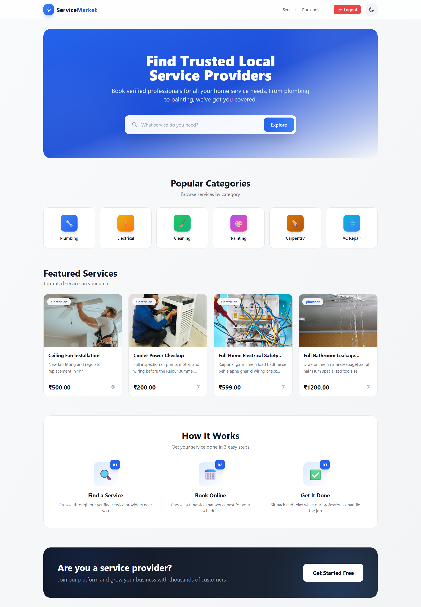
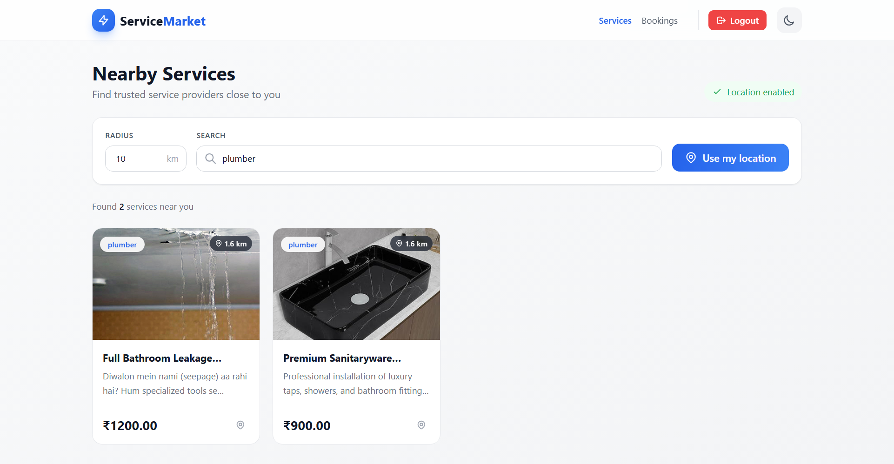
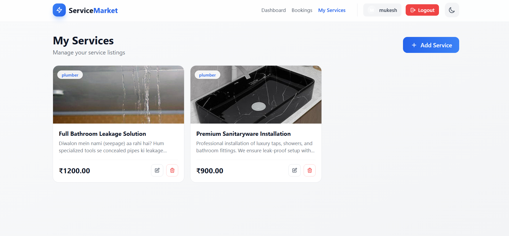
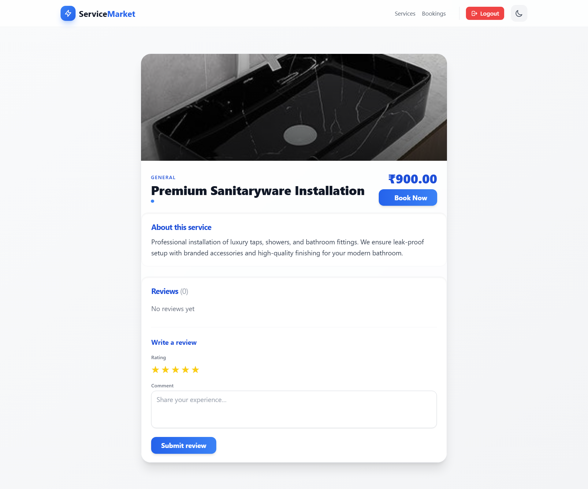
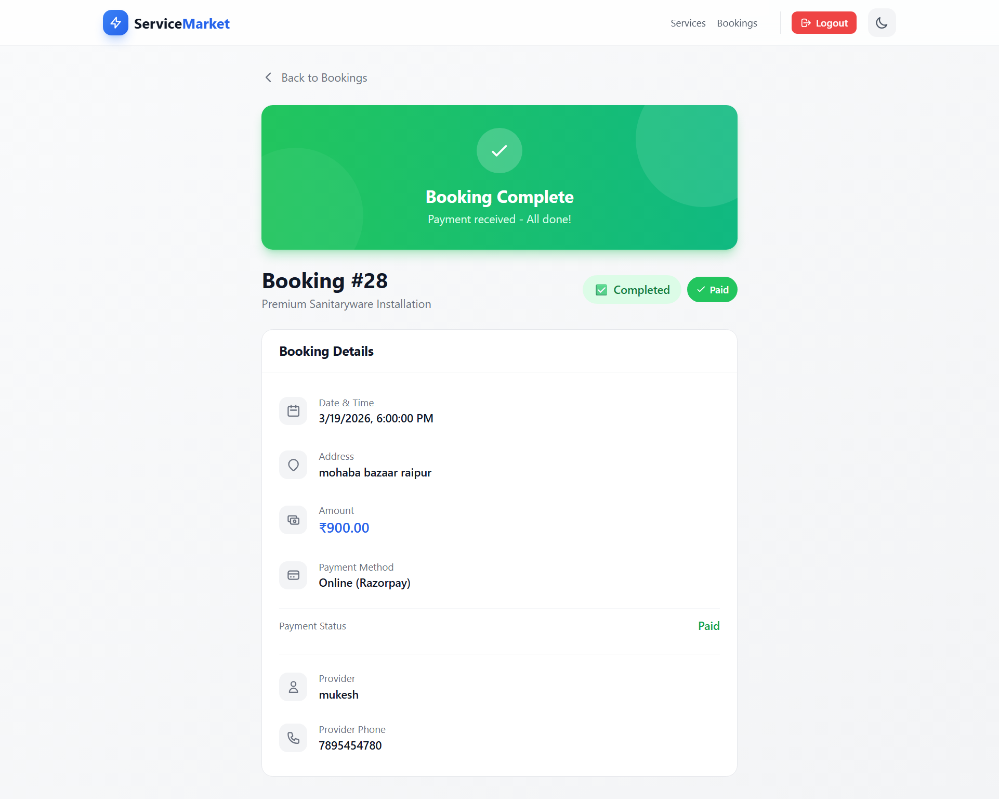
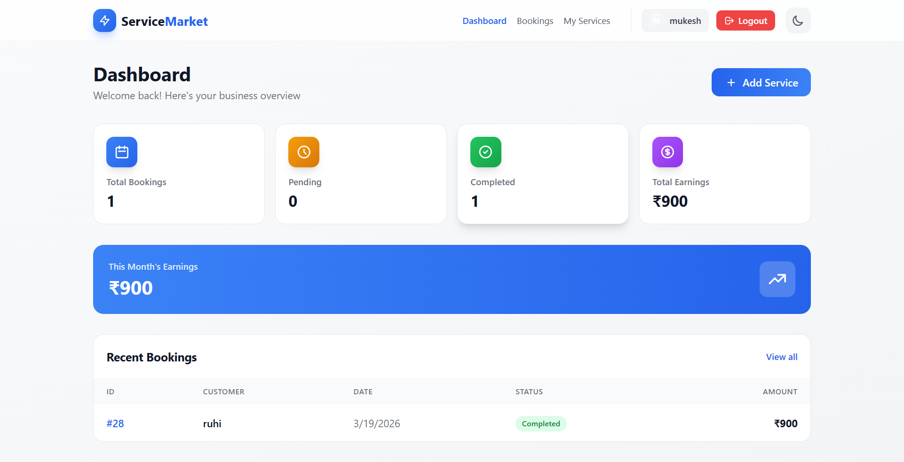
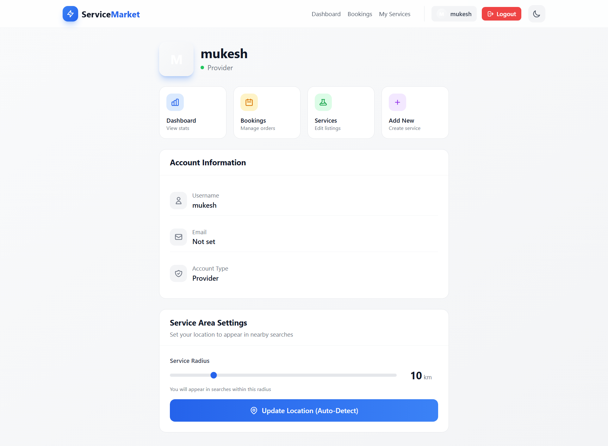
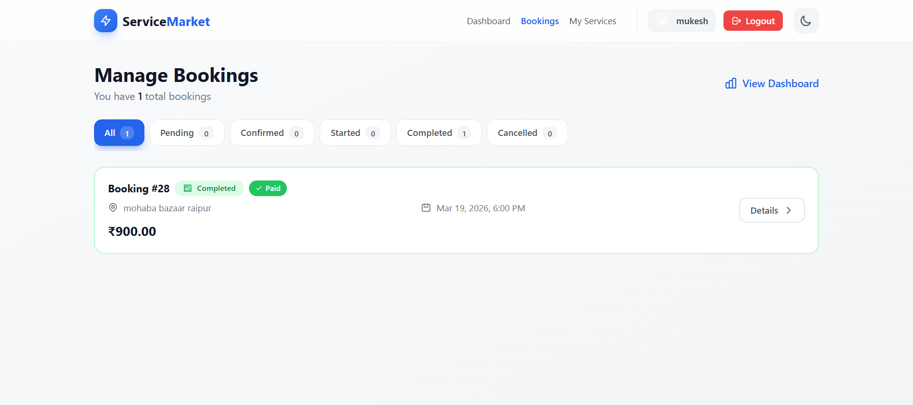
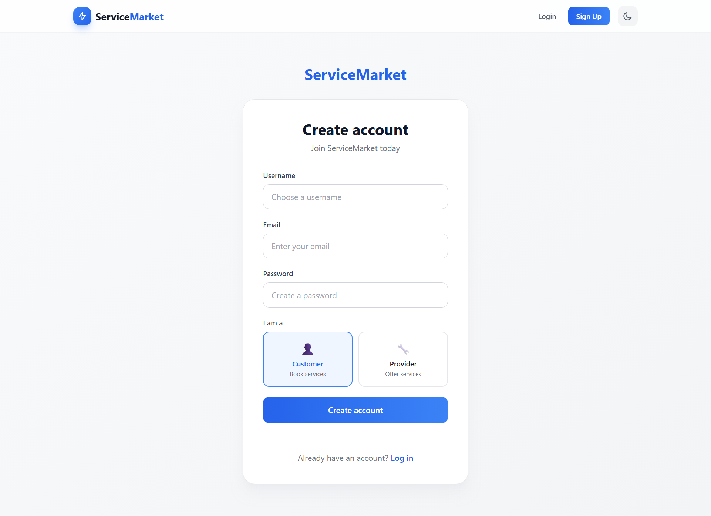

# Service Market

A full-stack service marketplace platform where service providers can list their services and customers can browse, book, and pay for services. The platform supports location-based service discovery, booking management with OTP verification, and integrated payment processing.

## Features

### For Customers
- Browse and search services by category
- Find nearby services using location-based filtering
- Book services with flexible scheduling
- Online payment via Razorpay or cash on delivery
- Track booking status (pending, confirmed, started, completed)
- Leave reviews for completed services

### For Service Providers
- Create and manage service listings with images
- Dashboard to view booking statistics
- Manage incoming bookings (confirm, start, complete)
- OTP-based verification for service start and completion

### General
- JWT-based authentication
- User registration with role selection (Provider/Customer)
- Dark mode support
- Responsive design

## Screenshots

### Home Page


### Services Listing


### my services page


### Service Details


### Booking Page


### Provider Dashboard


### Provider Profile


### My Bookings


### Signup Page


## Tech Stack

### Backend
- **Framework:** Django 6.0 with Django REST Framework
- **Database:** SQLite (development)
- **Authentication:** JWT via Simple JWT
- **Image Storage:** Cloudinary
- **Payment Gateway:** Razorpay
- **Other:** django-filter, django-cors-headers

### Frontend
- **Framework:** React 19 with Vite
- **Styling:** Tailwind CSS
- **Routing:** React Router v7
- **HTTP Client:** Axios
- **Icons:** Lucide React

## Project Structure

```
service-market/
├── backend/
│   ├── apps/
│   │   ├── users/        # User management & authentication
│   │   ├── services/     # Service listings & categories
│   │   ├── booking/      # Booking & payment management
│   │   └── reviews/      # Service reviews
│   ├── backend/          # Django settings & URLs
│   ├── media/            # Uploaded files
│   └── manage.py
├── frontend/
│   ├── src/
│   │   ├── api/          # API client configuration
│   │   ├── components/   # Reusable UI components
│   │   ├── contexts/     # React context (Auth, Theme)
│   │   └── pages/        # Page components
│   └── package.json
└── README.md
```

## Getting Started

### Prerequisites
- Python 3.10+
- Node.js 18+
- npm or yarn

### Backend Setup

1. Navigate to the backend directory:
   ```bash
   cd backend
   ```

2. Create and activate a virtual environment:
   ```bash
   python -m venv venv
   source venv/bin/activate  # On Windows: venv\Scripts\activate
   ```

3. Install dependencies:
   ```bash
   pip install django djangorestframework djangorestframework-simplejwt django-cors-headers django-filter cloudinary python-dotenv razorpay
   ```

4. Create a `.env` file with the following variables:
   ```env
   SETTINGS_SECRET_KEY=your-django-secret-key
   CLOUDINARY_CLOUD_NAME=your-cloudinary-cloud-name
   CLOUDINARY_API_KEY=your-cloudinary-api-key
   CLOUDINARY_API_SECRET=your-cloudinary-api-secret
   RAZORPAY_KEY_ID=your-razorpay-key-id
   RAZORPAY_KEY_SECRET=your-razorpay-key-secret
   ```

5. Run migrations:
   ```bash
   python manage.py migrate
   ```

6. Create a superuser (optional):
   ```bash
   python manage.py createsuperuser
   ```

7. Start the development server:
   ```bash
   python manage.py runserver
   ```

The backend API will be available at `http://localhost:8000`

### Frontend Setup

1. Navigate to the frontend directory:
   ```bash
   cd frontend
   ```

2. Install dependencies:
   ```bash
   npm install
   ```

3. Start the development server:
   ```bash
   npm run dev
   ```

The frontend will be available at `http://localhost:5173`

## API Endpoints

### Authentication
- `POST /api/users/register/` - User registration
- `POST /api/users/login/` - User login (JWT token)
- `POST /api/users/logout/` - User logout

### Services
- `GET /api/services/` - List all services
- `GET /api/services/:id/` - Get service details
- `POST /api/services/` - Create service (providers only)
- `PUT /api/services/:id/` - Update service
- `DELETE /api/services/:id/` - Delete service
- `GET /api/services/categories/` - List categories

### Bookings
- `GET /api/bookings/` - List user bookings
- `POST /api/bookings/` - Create booking
- `GET /api/bookings/:id/` - Get booking details
- `PATCH /api/bookings/:id/` - Update booking status
- `POST /api/bookings/confirm/:booking_id/` - Confirm booking (provider)
- `POST /api/bookings/cancel/:booking_id/` - Cancel booking
- `POST /api/bookings/start/:booking_id/` - Start service (with OTP)
- `POST /api/bookings/complete/:booking_id/` - Complete service (with OTP)

### Payments
- `POST /api/bookings/payment/:booking_id/` - Initiate Razorpay payment
- `POST /api/bookings/:booking_id/verify/` - Verify payment signature

### Reviews
- `GET /api/reviews/` - List reviews
- `POST /api/reviews/` - Create review

## Environment Variables

### Backend
| Variable | Description |
|----------|-------------|
| `SETTINGS_SECRET_KEY` | Django secret key |
| `CLOUDINARY_CLOUD_NAME` | Cloudinary cloud name |
| `CLOUDINARY_API_KEY` | Cloudinary API key |
| `CLOUDINARY_API_SECRET` | Cloudinary API secret |
| `RAZORPAY_KEY_ID` | Razorpay key ID |
| `RAZORPAY_KEY_SECRET` | Razorpay key secret |

## License

This project is open source and available under the [MIT License](LICENSE).
